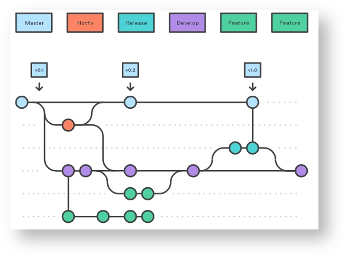
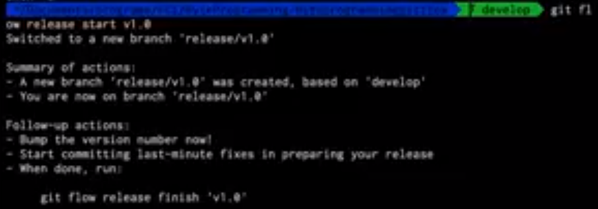
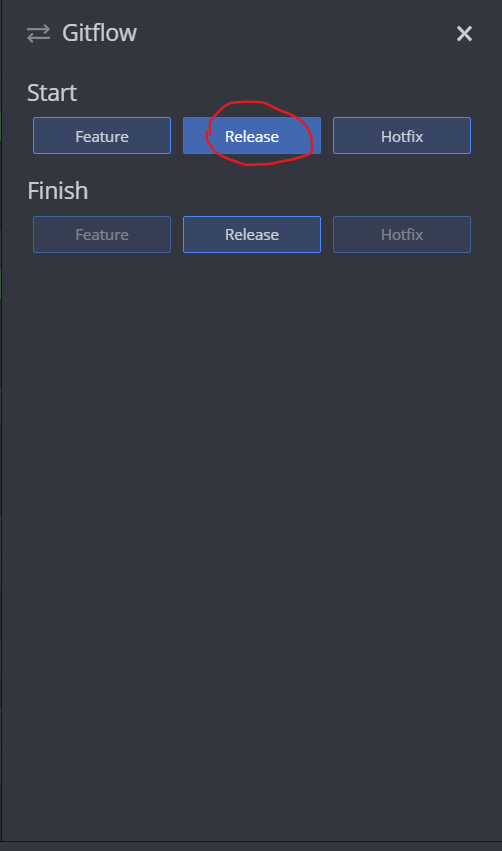

# GitFlow
Guia de uso  GitFlow

## Integrantes:
- Carlos Gomez
- Juan Rojas
- Santiago Rubiano
- Alejandro Bohorquez 
- Andrés Marcelo


## Que es GitFlow
GitFlow es un flujo de trabajo aplicado a un repositorio Git. Vincent Driessen fue el encargado de popularizarlo, definiendo un modelo estricto de ramificación diseñado en torno a los lanzamientos del proyecto. Es ideal para proyectos que lleven una planificación de entregas iterativas. Permite la paralelización del desarrollo mediante ramas independientes para la preparación, mantenimiento y publicación de versiones del proyecto así como soporta la reparación de errores en cualquier momento.

## Por qué deberíamos implementarlo?
* Aumenta la velocidad de entrega de código terminado al equipo de pruebas.
* Disminuyen los errores humanos en la mezcla de las ramas.
* Elimina la dependencia de funcionalidades al momento de entregar código para ser puesto en producción.


## ¿Cuándo se recomienda implementarlo?
 

* El equipo de trabajo está conformado por más de dos (2) personas.
* Se emplean metodologías ágiles.
* El proyecto tiene cambios frecuentes y se requiere actualizar el ambiente de producción garantizando continuidad en la operación.
* El proyecto tiene un nivel de complejidad considerable.
* Se desea tener un proceso de soporte a errores efectivo con actualizaciones rápidas.

## Esctructura GitFlow 

 

## Contenido de cada rama

Existen 4 diferentes tipos de ramas que GitFlow nos da. En cada una de ellas tendremos
diferentes contenidos para tener de manera mas organizada nuestro codigo. Las diferentes 
ramas son:
1. develop
2. feature
3. release
4. hotfix


## Inicializando un repositorio con GitFlow

Las ventajas de inicializar un repositorio con GitFlow es ordenar
el flujo de trabajo en ramas de la siguiente manera.

 git flow init 


en GitKraken, clonamos el repositorio y editamos las preferencias.


y observamos un ejemplo de flujo de trabajo en GitKraken


## Inicializar un realease 
Esta función se realiza cuando se ha terminado un sprint, cuando se tiene el codigo listo para entregar a producción
en esta rama se suele hacer pruebas de QA y al inicializarse toma la ultima version de la rama develop

### En consola 

 ``` git flow realease start <nombre de version > ```
 


### Git Kraken

