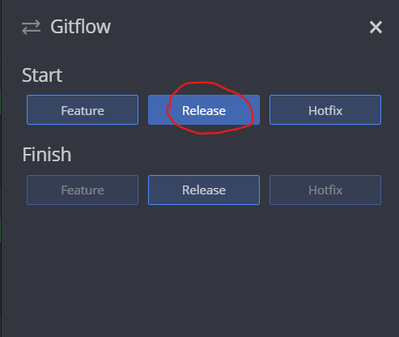

# GitFlow
Guia de uso  GitFlow

## Integrantes:
- Carlos Gomez
- Juan Rojas
- Santiago Rubiano
- Alejandro Bohorquez 
- Andrés Marcelo


## Que es GitFlow
GitFlow es un flujo de trabajo aplicado a un repositorio Git. Vincent Driessen fue el encargado de popularizarlo, definiendo un modelo estricto de ramificación diseñado en torno a los lanzamientos del proyecto. Es ideal para proyectos que lleven una planificación de entregas iterativas. Permite la paralelización del desarrollo mediante ramas independientes para la preparación, mantenimiento y publicación de versiones del proyecto así como soporta la reparación de errores en cualquier momento.

## Por qué deberíamos implementarlo?
* Aumenta la velocidad de entrega de código terminado al equipo de pruebas.
* Disminuyen los errores humanos en la mezcla de las ramas.
* Elimina la dependencia de funcionalidades al momento de entregar código para ser puesto en producción.


## ¿Cuándo se recomienda implementarlo?
 

* El equipo de trabajo está conformado por más de dos (2) personas.
* Se emplean metodologías ágiles.
* El proyecto tiene cambios frecuentes y se requiere actualizar el ambiente de producción garantizando continuidad en la operación.
* El proyecto tiene un nivel de complejidad considerable.
* Se desea tener un proceso de soporte a errores efectivo con actualizaciones rápidas.

## Esctructura GitFlow 

 

## Contenido de cada rama

Existen 4 diferentes tipos de ramas que GitFlow nos da. En cada una de ellas tendremos
diferentes contenidos para tener de manera mas organizada nuestro codigo. Las diferentes 
ramas son:
1. develop
2. feature
3. release
4. hotfix


## Inicializando un repositorio con GitFlow

Las ventajas de inicializar un repositorio con GitFlow es ordenar
el flujo de trabajo en ramas de la siguiente manera.

 git flow init 


en GitKraken, clonamos el repositorio y editamos las preferencias.


y observamos un ejemplo de flujo de trabajo en GitKraken


 
# Comandos en GitFlow

### Inicializar un feature

En la terminal podemos utilizar el siguiente codigo para poder inicializar un feature

```
    git flow feature start NOMBREFEATURE
```

De igual manera mediante GitKraken podemos hacer lo mismo de la siguiente manera:


Y de esta manera quedarian nuestras ramas, en donde la rama morada, roja, naranja, amarilla y verde son features creadas
para poder tener las diferentes 


## Publicar y finalizar Feature 

### Publicar

El comando en consola para hacer la publicación del feature

``` git flow feature publish MYFEATURE ```

 

En GitKraken es haciendo solamente un push de la rama que queremos


### Finalizar

El comando en consola para hacer la finalización del feature

``` git flow feature finish MYFEATURE ```

En GitKraken en el panel de la izquierda vemos la opcion de gitflow en la cual podemos finalizar de la rama que queremos


## Inicializar un realease 
Esta función se realiza cuando se ha terminado un sprint, cuando se tiene el codigo listo para entregar a producción
en esta rama se suele hacer pruebas de QA y al inicializarse toma la ultima version de la rama develop

### En consola 

 ``` git flow release start <nombre de version > ```
 


### Git Kraken



### Finalizar un release

Es importante destacar que un release se finaliza cuando 
el proyecto está lo suficientemente avanzado para salir a producción,
o se encuentra listo para pruebas de integracion.

para finalizar un release utilizamos el comando de consola

 // Comando para finalizar release
 ``` git flow release finish "Nombre de version" ```
 
Ejemplo:  


Nos pedirá añadir  un comentario para el tag de la versión  

  


 // Finalmente, se publica la version  
 ``` git push origin --tags ```

Y git nos muestra un resumen de lo realizado.  

  


### Realizar un Hotfix  

En consola podemos realizar un hotfix con el siguiente comando:  

``` $ git flow hotfix start hotfix_branch  ```

Con GitKraken podemos inicializar un hotfix de la siguiente forma:  

  

 

Se recomienda poner el nombre del hotfix con el versionamiento correspondiente. Ej: v1.1 - v0.1.1.  

Una vez ya esten los cambios realizados, debido a que Hotfix no posee un comando de publicación  
basta con realizar el commit y usar el comando:  

``` $ git flow hotfix finish ```  

Realizar la documentación de los cambios para el merge con develop y con master y hacer push.  

En GitKraken Basta con Finalizar el hotfix en el mismo panel donde se inició, si se desea borrar la rama hotfix, comentar los cambios y hacer push a Origin.
